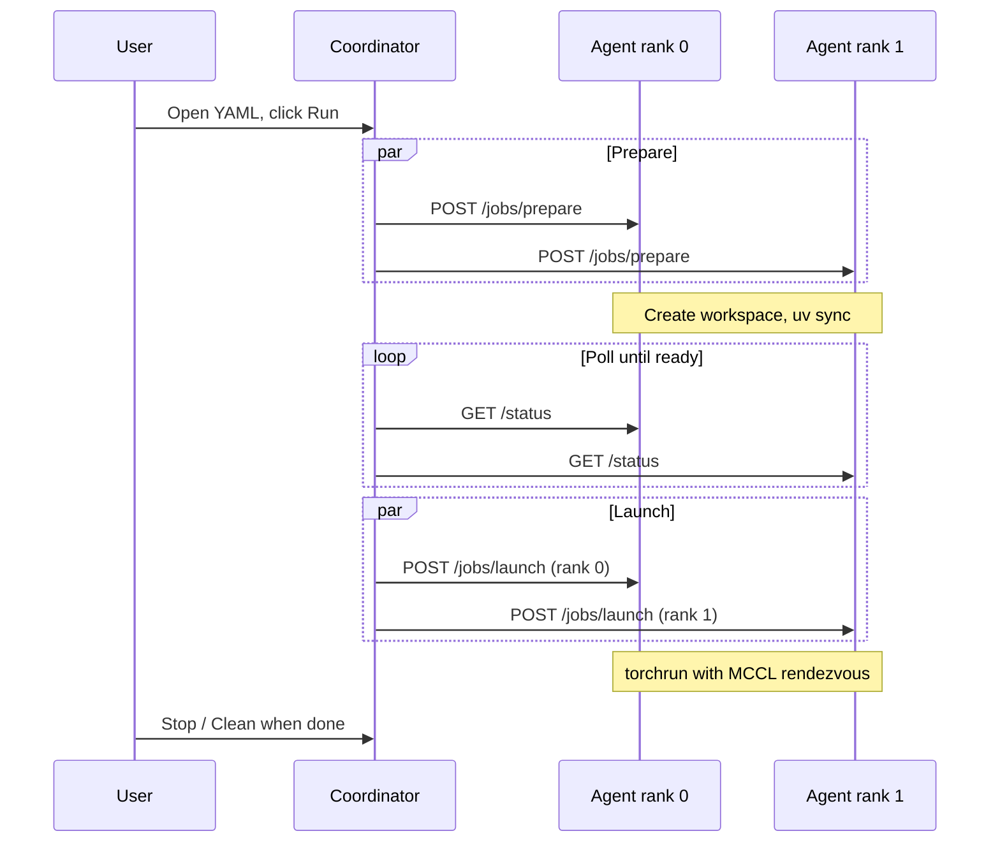

# measured.one.distribute-metal

A macOS menu bar app by [measured.one](https://measured.one) that turns a handful of Apple Silicon Macs into a distributed PyTorch training cluster using Metal and the [MCCL](https://github.com/mps-ddp/mccl) backend for `torch.distributed`.

**Ship a YAML file. Click run. Train on every Mac in the room.**

## Overview

```
┌──────────────────┐       ┌──────────────────┐
│  Mac A (rank 0)  │◄─────►│  Mac B (rank 1)  │
│  menu bar app    │ MCCL  │  agent            │
│  + agent         │ DDP   │                   │
└──────────────────┘       └──────────────────┘
         ▲                          ▲
         │  Bonjour discovery       │
         │  + shared cluster token  │
         └──────────┬───────────────┘
                    │
            distribute-metal.yaml
```

Every Mac in the cluster runs the same two things: the **menu bar app** (coordinator UI) and the **Python agent** (HTTP worker on port 8477). Bonjour handles discovery. A shared token prevents unauthorized access. The MCP server lets AI agents in Cursor inspect the cluster and generate job specs.

## Requirements

- **Apple Silicon Mac** (M1 or later) -- Intel is not supported for Metal DDP
- **macOS 14+** (Sonoma)
- **Python 3.11+**
- **[uv](https://docs.astral.sh/uv/)** for reproducible environment provisioning
- **PyTorch 2.5+** and **[mccl](https://pypi.org/project/mccl/) 0.3+** in your project's `pyproject.toml`

---

## Step 1: Install on every Mac

```bash
brew install goldberg-consulting/tap/distribute-metal
```

This installs the signed, notarized menu bar app to `/Applications`. Run it on **every Mac** you want in the cluster.

Then clone the repo (or download the agent separately) and start the agent:

```bash
git clone https://github.com/goldberg-consulting/measured.one.distribute-metal.git
cd measured.one.distribute-metal/agent
uv sync
uv run distribute-metal-agent
```

The agent runs on port 8477 and accepts jobs from the coordinator.

**Verify the agent is running:**

```bash
uv run distribute-metal status
```

```
Agent:   0.1.0
State:   idle
Chip:    Apple M2 Pro
Memory:  32 GB
Python:  3.12.12
uv:      yes
mccl:    0.3.1
Disk:    171.6 GB free
```

## Step 2: Set up the cluster token

Every machine in the cluster shares the same token. This prevents other devices on your network from submitting jobs to your agents.

**Generate a token and save it on every Mac:**

```bash
# On the first machine, generate a token
python3 -c "import secrets; print(secrets.token_urlsafe(32))" > ~/.config/distribute-metal/token

# Copy that same token to every other Mac in the cluster
# The file is just one line: the token string
cat ~/.config/distribute-metal/token
```

Alternatively, set the `DISTRIBUTE_METAL_TOKEN` environment variable.

If no token is configured, the agent runs without authentication and logs a warning. Fine for a private network, not recommended otherwise.

**How auth works:**

- `GET /status` is always open (Bonjour probes and MCP queries work without a token)
- All mutating endpoints (`POST /jobs/prepare`, `POST /jobs/launch`, etc.) require `Authorization: Bearer <token>`
- The menu bar app and MCP server both read the token from `~/.config/distribute-metal/token`

## Step 3: Discover peers

Peers find each other in two ways:

1. **Bonjour (automatic).** The menu bar app advertises and browses `_distributemetal._tcp` on the local network. Other Macs running the app appear in the peers list within seconds. Press **Scan** to refresh.

2. **Manual.** Click **+** in the peers section and enter an IP address. Useful for machines on different subnets.

Each discovered peer is immediately probed via `GET /status` to verify the agent is running and to pull hardware info (chip, memory, macOS version, mccl version, disk space). Peers show as **ready**, **busy**, or **offline**.

## Step 4: Check the cluster with MCP

The MCP server is the AI-powered layer for cluster inspection and job setup. It runs inside Cursor and is configured automatically via `.cursor/mcp.json`.

**What the MCP can see:**

| Tool | What it inspects | What it returns |
|------|-----------------|-----------------|
| `cluster_status` | Every peer's agent via HTTP | Hardware, software versions, state, disk |
| `peer_preflight` | One peer's agent | Readiness issues (missing mccl, low disk, busy) |
| `generate_yaml` | Your project directory | A complete `distribute-metal.yaml` |
| `validate_yaml` | An existing YAML file | Structural errors, missing files |
| `preflight_job` | YAML spec + every peer | Go/no-go verdict: what the project needs vs what the cluster has |

**What the MCP cannot do:** install software, transfer files, or execute training. It is read-only. It reports gaps so you can fix them.

**Example conversation in Cursor:**

> *"Generate a distribute-metal.yaml for this project"*
>
> The MCP inspects your `pyproject.toml`, finds `train.py`, detects the `data/` directory, reads the Python version constraint, checks if `mccl` is in your dependencies, and produces a complete YAML.

> *"Is my cluster ready to run this?"*
>
> The MCP calls `preflight_job`: validates the YAML, queries every peer, and reports back:
> "Spec is valid. 2 peers reachable. Peer studio-mac is ready. Peer macbook-pro is missing mccl. Install with `pip install mccl>=0.3.0` on macbook-pro."

> *"What's my cluster status?"*
>
> Returns chip, memory, macOS, Python, uv, mccl, disk, and agent state for every configured peer.

### Configure peers for the MCP

The MCP reads peers from `~/.config/distribute-metal/peers.yaml`:

```yaml
peers:
  - ip: 192.168.1.100
    port: 8477
    name: studio-mac
  - ip: 192.168.1.101
    port: 8477
    name: macbook-pro
```

Bonjour discovery in the menu bar app handles this automatically, but the MCP server needs this file because it runs as a stdio process without access to the app's Bonjour state.

## Step 5: Create the job spec

Three ways to create your `distribute-metal.yaml`:

### Option A: MCP in Cursor (recommended)

Ask Cursor: *"generate a distribute-metal.yaml for this project."* The MCP inspects your project and produces the YAML. Then ask *"is my cluster ready?"* to preflight before submitting.

### Option B: CLI

```bash
cd /path/to/your/training-project
distribute-metal init
```

Inspects `pyproject.toml`, detects the entrypoint, finds data directories, and writes `distribute-metal.yaml`.

### Option C: Menu bar app

Click **New Job from Folder...** in the DM menu bar, select your project directory. The app generates the YAML and loads it as a job in one step.

### Option D: Write it by hand

```yaml
version: 1

project:
  name: my-training-run
  entrypoint: train.py
  include:
    - "**/*.py"
    - pyproject.toml
    - uv.lock
  exclude:
    - ".git/**"
    - ".venv/**"

python:
  version: ">=3.11"
  pyproject: pyproject.toml
  lockfile: uv.lock

training:
  backend: mccl
  torchrun:
    nproc_per_node: 1
    script_args:
      - --config=configs/train.yaml

data: []

sync:
  mode: bulk
  parallel_connections: 8

cleanup:
  delete_venv_on_success: true
  retain_logs_days: 7

validation:
  require_arm64: true
  min_free_disk_gb: 10
  required_tools: [uv, python3]
```

See `schemas/distribute-metal.v1.yaml` for the full reference.

## Step 6: Submit and run

1. Click the **DM** icon in your menu bar.
2. Verify your peers are listed and showing **ready**.
3. Click **Open distribute-metal.yaml...** and select your spec file.
4. The job appears with peer count and world size. Click **Run**.

The coordinator executes the following sequence:



**Prepare:** each agent creates a workspace at `~/Library/Application Support/DistributeMetal/jobs/<job_id>/`, provisions a `uv` virtual environment from `pyproject.toml`.

**Launch:** each agent starts `torchrun` with `--node_rank`, `--master_addr`, `--master_port`, `--world_size`. MCCL handles gradient all-reduce over Metal.

**Clean:** when finished, click **Clean** to remove workspaces from all peers.

## The training script

Your script follows standard PyTorch DDP patterns with the `mccl` backend:

```python
import mccl  # must be imported before init_process_group
import torch.distributed as dist
from torch.nn.parallel import DistributedDataParallel as DDP

dist.init_process_group(backend="mccl", device_id=torch.device("mps:0"))
model = DDP(model.to("mps:0"))
# ... standard training loop with DistributedSampler
dist.destroy_process_group()
```

See `examples/mccl_ddp_train/` for a complete working example.

## Agent HTTP API

All POST/PUT endpoints require `Authorization: Bearer <token>` when a cluster token is configured.

| Method | Path | Auth | Purpose |
|--------|------|------|---------|
| `GET` | `/status` | No | Hardware info, agent state, job ID |
| `POST` | `/jobs/prepare` | Yes | Create workspace, start `uv` provisioning |
| `POST` | `/jobs/launch` | Yes | Start `torchrun` with rank and rendezvous params |
| `POST` | `/jobs/stop` | Yes | SIGTERM the torchrun process |
| `GET` | `/jobs/{job_id}/logs` | No | Tail the torchrun log |
| `POST` | `/jobs/clean` | Yes | Stop job, delete workspace |

## Project structure

```
measured.one.distribute-metal/
├── apps/DistributeMetal/     # Swift macOS menu bar app (coordinator)
│   ├── App/                  # Entry point + AppDelegate
│   ├── Models/               # Peer, Job, AgentAPI types
│   ├── Services/             # Bonjour discovery, agent HTTP client, orchestrator
│   ├── Utilities/            # YAML decoder, network utils, YAML generator
│   └── Views/                # SwiftUI menu bar UI
├── agent/                    # Python worker agent + CLI
│   └── src/distribute_metal_agent/
├── mcp/distribute-metal-mcp/ # MCP server for Cursor AI integration
│   └── src/distribute_metal_mcp/
├── schemas/                  # YAML spec reference
├── examples/mccl_ddp_train/  # Example training project
├── scripts/
│   ├── build-app.sh          # Dev build
│   ├── build-release.sh      # Signed + notarized DMG
│   └── release.sh            # Full release pipeline
├── VERSION
├── DistributeMetal.entitlements
├── .env.example
└── LICENSE                   # MIT
```

## Current limitations (v0.1)

- **No automatic code sync.** Project source must be present at each agent's workspace before running. Use `rsync`, a shared volume, or copy manually. Bundle upload is defined but not yet implemented.
- **Entrypoint is fixed at `train.py`.** The agent does not yet read `project.entrypoint` from the YAML spec.
- **No completion polling from the UI.** The coordinator does not automatically detect when training finishes.
- **MCP peer list is static.** The MCP reads peers from a YAML file rather than from Bonjour. Bonjour-discovered peers in the menu bar app are not automatically synced to the MCP config.

## Releasing

```bash
bash scripts/release.sh patch   # 0.1.2 -> 0.1.3
bash scripts/release.sh minor   # 0.1.2 -> 0.2.0
bash scripts/release.sh 1.0.0   # explicit version
```

Builds the DMG, notarizes with Apple, creates a GitHub release, and updates the Homebrew cask automatically.

## License

[MIT](LICENSE)
