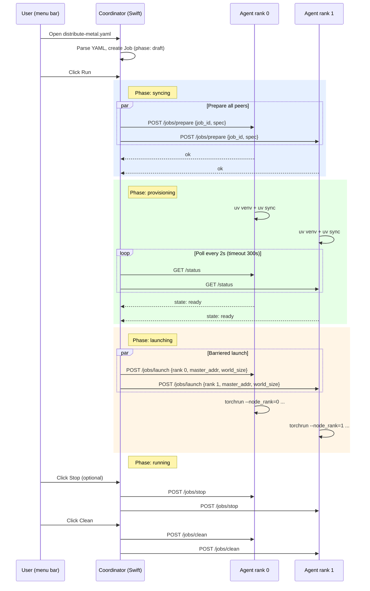

# DistributeMetal

A macOS menu bar app that turns a handful of Apple Silicon Macs into a distributed PyTorch training cluster using Metal and the [MCCL](https://github.com/mps-ddp/mccl) backend for `torch.distributed`.

**Ship a YAML file. Click run. Train on every Mac in the room.**

## How it works

```
┌──────────────────┐       ┌──────────────────┐
│  Mac A (rank 0)  │◄─────►│  Mac B (rank 1)  │
│  DistributeMetal  │ MCCL  │  DistributeMetal  │
│  menu bar app    │ DDP   │  agent            │
└──────────────────┘       └──────────────────┘
         ▲                          ▲
         │  Bonjour discovery       │
         │  + bulk sync             │
         └──────────┬───────────────┘
                    │
            distribute-metal.yaml
```

1. Define your training job in a `distribute-metal.yaml` at your project root.
2. Start the Python agent on each Mac you want in the cluster.
3. The coordinator (menu bar app) discovers peers via Bonjour, provisions a `uv` virtual environment on each Mac, and launches `torchrun` with consistent ranks.
4. MCCL handles gradient all-reduce over Metal Performance Shaders across the network.
5. When the job finishes, you can clean up workspaces from the menu bar.

## Requirements

- **Apple Silicon Mac** (M1 or later) -- Intel is not supported for Metal DDP
- **macOS 14+** (Sonoma)
- **Python 3.11+**
- **[uv](https://docs.astral.sh/uv/)** for reproducible environment provisioning
- **PyTorch 2.5+** and **[mccl](https://pypi.org/project/mccl/) 0.3+** declared in your project's `pyproject.toml`

## Install

### Homebrew (recommended)

```bash
brew install goldberg-consulting/tap/distribute-metal
```

This installs the signed, notarized app directly to your Applications folder.

### From DMG

Download the latest `DistributeMetal-x.x.x.dmg` from [Releases](https://github.com/goldberg-consulting/distribute-metal/releases), open it, and drag to Applications.

### Build from source

```bash
git clone https://github.com/goldberg-consulting/distribute-metal.git
cd distribute-metal

# Dev build (installs to /Applications and launches)
bash scripts/build-app.sh

# Release build (signed + notarized DMG)
cp .env.example .env   # fill in your Apple ID credentials
bash scripts/build-release.sh
```

## Quick start

### 1. Start the agent on every worker Mac

```bash
cd agent
uv sync
uv run distribute-metal-agent
```

This starts an HTTP agent on port 8477 that accepts jobs from the coordinator.

### 2. Create a job spec

Place a `distribute-metal.yaml` at the root of your training project:

```yaml
version: 1

project:
  name: my-training-run
  entrypoint: train.py
  include:
    - "**/*.py"
    - pyproject.toml
    - uv.lock

python:
  version: ">=3.11"
  pyproject: pyproject.toml
  lockfile: uv.lock

training:
  backend: mccl
  torchrun:
    nproc_per_node: 1
    script_args:
      - --config=configs/train.yaml

cleanup:
  delete_venv_on_success: true
  retain_logs_days: 7
```

Or let the MCP generate one for you; see [MCP integration](#mcp-integration) below.

### 3. Run from the menu bar

Click the **DM** icon in your menu bar, add peers (or let Bonjour find them), open your `distribute-metal.yaml`, and hit **Run**. The coordinator handles rank assignment, environment provisioning, and barriered launch.

## Submission lifecycle

When you click **Run**, the coordinator and agents execute this sequence:



### Step by step

1. **Open YAML.** The menu bar shows an "Open distribute-metal.yaml..." button. Selecting a file parses the spec and creates a `Job` in draft state. The peers list is populated from Bonjour discovery (automatic) or manual entry.

2. **Prepare.** The coordinator sends `POST /jobs/prepare` to every agent in parallel. Each agent creates a workspace at `~/Library/Application Support/DistributeMetal/jobs/<job_id>/` with `src/`, `data/`, and `logs/` subdirectories, then starts provisioning a virtual environment using `uv venv` + `uv sync` from the `pyproject.toml` in `src/`.

3. **Wait for ready.** The coordinator polls `GET /status` on each agent every 2 seconds until all report `state: ready` (or one reports `failed`). Timeout is 300 seconds.

4. **Launch.** Once all agents are ready, the coordinator sends `POST /jobs/launch` to every agent simultaneously. Each launch request includes the `master_addr` (rank-0 peer's IP), `master_port` (default 29500), `world_size`, `node_rank` (sequential index in the peer list), and `nproc_per_node`. The agent starts `torchrun` as a subprocess with these parameters. Stdout and stderr go to `logs/torchrun.log`.

5. **Running.** Each machine's `torchrun` process performs the MCCL rendezvous using `master_addr:master_port` and begins training. The coordinator shows the job as "running."

6. **Completion.** When `torchrun` exits on an agent, the next `GET /status` call detects the exit code and transitions the agent to `ready` (exit 0) or `failed`. The user can then **Stop** any remaining agents and **Clean** to remove workspaces.

### Agent HTTP API

| Method | Path | Purpose |
|--------|------|---------|
| `GET` | `/status` | Hardware info, agent state, job ID. Detects torchrun exit. |
| `POST` | `/jobs/prepare` | Create workspace, start `uv` provisioning (async). |
| `POST` | `/jobs/launch` | Start `torchrun` with rank and rendezvous parameters. |
| `POST` | `/jobs/stop` | SIGTERM the torchrun process (SIGKILL after 15s). |
| `GET` | `/jobs/{job_id}/logs` | Tail the torchrun log (default 200 lines). |
| `POST` | `/jobs/clean` | Stop job, delete workspace (src, venv, data). |

### Workspace layout on each agent

```
~/Library/Application Support/DistributeMetal/jobs/<job_id>/
├── src/              # Project source (pyproject.toml, training scripts)
├── data/             # Training data
├── logs/
│   └── torchrun.log  # Combined stdout/stderr from torchrun
└── .venv/            # uv-managed virtual environment
```

### Current limitations (v0.1)

- **No automatic code sync.** The project source must be present at each agent's workspace before running. Use `rsync`, a shared volume, or copy manually. Bundle upload (`PUT /jobs/{job_id}/bundle`) is defined but returns 501 pending implementation.
- **Entrypoint is fixed at `train.py`.** The agent does not yet read `project.entrypoint` from the YAML spec. This will be wired in a future release.
- **No completion polling from the UI.** The coordinator does not automatically detect when training finishes. Check agent status manually or watch the torchrun logs.

## Project structure

```
distribute-metal/
├── apps/DistributeMetal/     # Swift macOS menu bar app (coordinator)
│   ├── Package.swift
│   ├── App/                  # Entry point + AppDelegate
│   ├── Models/               # Peer, Job, AgentAPI types
│   ├── Services/             # Bonjour discovery, agent HTTP client, orchestrator
│   └── Views/                # SwiftUI menu bar UI
├── agent/                    # Python worker agent (FastAPI on port 8477)
│   └── src/distribute_metal_agent/
├── mcp/distribute-metal-mcp/ # MCP server for Cursor AI integration
│   └── src/distribute_metal_mcp/
├── schemas/                  # YAML spec reference
├── examples/mccl_ddp_train/  # Example training project with MCCL DDP
├── scripts/
│   ├── build-app.sh          # Dev build (debug, installs to /Applications)
│   ├── build-release.sh      # Signed + notarized DMG
│   └── release.sh            # Full release: build, GitHub release, cask bump
├── VERSION                   # Single source of truth for the version string
├── DistributeMetal.entitlements
├── .env.example
└── LICENSE                   # MIT
```

## MCP integration

DistributeMetal ships an [MCP](https://modelcontextprotocol.io/) server that Cursor (or any MCP client) can use to inspect the cluster and generate YAML specs.

**Tools available:**

| Tool | Description |
|------|-------------|
| `cluster_status` | Query all peers for hardware, state, Python/uv/mccl versions |
| `peer_preflight` | Check if a specific peer is ready for a job |
| `generate_yaml` | Inspect a project directory and produce a `distribute-metal.yaml` |
| `validate_yaml` | Validate an existing spec against the schema |

The MCP server is auto-registered in `.cursor/mcp.json`. In Cursor, just ask: *"generate a distribute-metal.yaml for this project"* or *"what's my cluster status?"*

### Configure peers

Create `~/.config/distribute-metal/peers.yaml`:

```yaml
peers:
  - ip: 192.168.1.100
    port: 8477
    name: studio-mac
  - ip: 192.168.1.101
    port: 8477
    name: macbook-pro
```

## The training script

Your training script must follow standard PyTorch DDP patterns with the `mccl` backend:

```python
import mccl  # must be imported before init_process_group
import torch.distributed as dist
from torch.nn.parallel import DistributedDataParallel as DDP

dist.init_process_group(backend="mccl", device_id=torch.device("mps:0"))
model = DDP(model.to("mps:0"))
# ... standard training loop with DistributedSampler
dist.destroy_process_group()
```

See `examples/mccl_ddp_train/` for a complete working example.

## Releasing

Version is tracked in a single `VERSION` file at the project root. All build scripts read from it.

To cut a release:

```bash
# Release the current VERSION
bash scripts/release.sh

# Bump patch (0.1.0 -> 0.1.1) and release
bash scripts/release.sh patch

# Bump minor (0.1.0 -> 0.2.0) and release
bash scripts/release.sh minor

# Bump to an explicit version and release
bash scripts/release.sh 0.3.0
```

The release script performs the following steps in order:

1. Writes the new version to `VERSION`.
2. Runs `build-release.sh` to produce a signed, notarized DMG.
3. Commits and pushes the version bump to `goldberg-consulting/distribute-metal`.
4. Creates a GitHub release with the DMG attached (or uploads to an existing release).
5. Computes the SHA256 of the DMG.
6. Clones `goldberg-consulting/homebrew-tap`, updates the cask's `version` and `sha256`, commits, and pushes.

After the script completes, `brew upgrade distribute-metal` picks up the new version automatically.

## License

[MIT](LICENSE)
